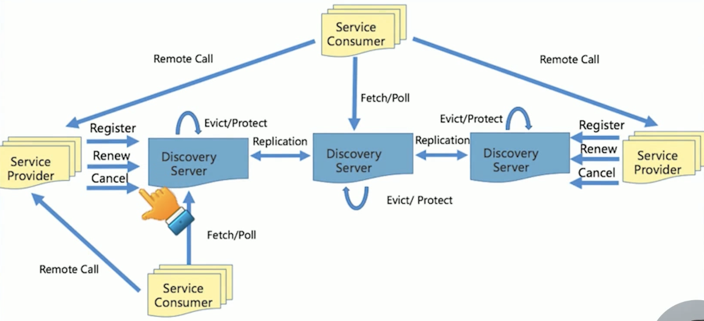

# 3 RPC Service Discovery

## gRPC

`A high-performance, open-source universal RPC framework`

- Mutil Language
- Light & Efficient: PB & JSON Marshal support.
- Pluginable
- IDL: Define server base on `.pboto`
- Design Concept: Divine
- Mobile: HTTP/2, Two-way Flow, SingleTCP, Multiplexing
- Server instead of Obj, Message instead of Reference.
- Metadata exchange
- Stander status code: Error code hint -> JSON; Stander error(http etc.) -> HTTP Status Code

`Stander First, Performance later`

### HealthCheck

Provider Unstable -> Remove;

k8s readiness -> gRPC HealthCheck: Server is useable or not.

Lame ducking

- Service Discovery in Microservice

- Service Discovery: 
    - Alibaba: Nacos
    - 螞蟻: SOFARegistry
    - NetFilx: Eureka

### Service Discovery
- Name rule: 業務.服務.子服務

