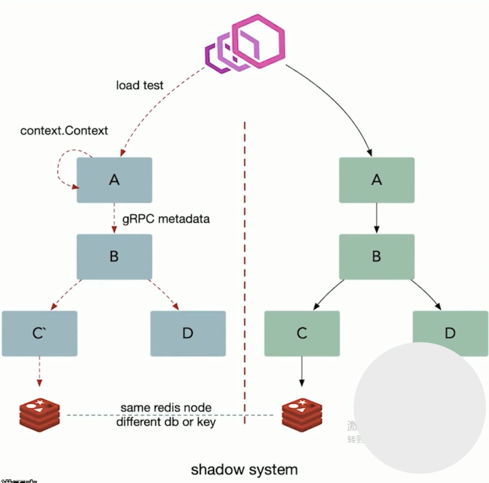

# 多集群 & 多租戶

## 多集群 
- 使用冗余的集群去對應多套獨佔的緩存
- 業務正常交互，數據正常交互
- Cache 命中率


### 合適的子集大小和選擇算法
- 子集算法: 部分連結 Cluster-xx

```python
def Subset(backends, client_id, subset_size): 
    subset_count = len(backends) / subset_size

    # Group clients into rounds; each round uses the same shuffled list:
    round = client_id / subset_count
    random.seed(round)
    random.shuffled(backends)

    # The subset id corresponds to the current client
    subset_id = client_id % subset_count

    start = subset_id * subset_size
    return backends [start:start + subset_size]
```

## 多租戶
- 允許多系統共存：租戶可以是測試，金絲雀發布，影子系統，甚至服務層或產品線。
- 使用租戶能保證代碼的隔離性。

### 並行測試
- 優點
    - 可以在不影響生產環境的情況下讓開發者穩定的測試服務
    - 能在發布前更容易識別和控制bug。
- 缺點：
    - 混用環境導致的不可靠測試。
    - 多套環境帶來的硬件成本。
    - 負載測試不可靠，因為用的是仿真線上流量。

### 染色發布
多租戶的結構基礎：
- 流量路由：能夠基於流入棧中的流量類型做路由
- 隔離性：能夠可靠的隔離測試和生產中的資源，這樣可以保證對於關鍵業務微服務沒有副作用


### Shadow system


跨服務傳遞請求加上 Context， 數據隔離的流量路由方案。
