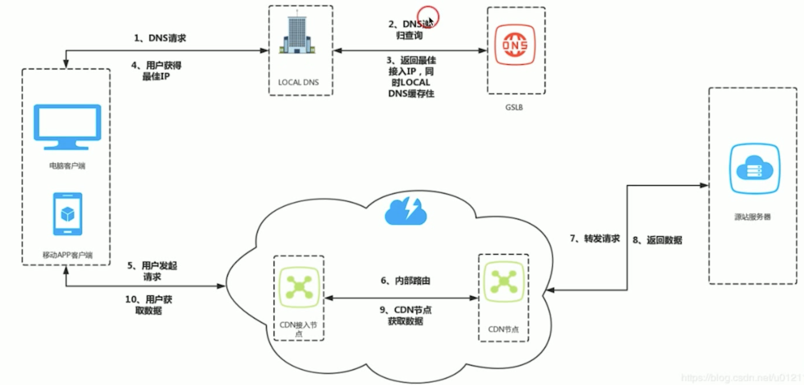
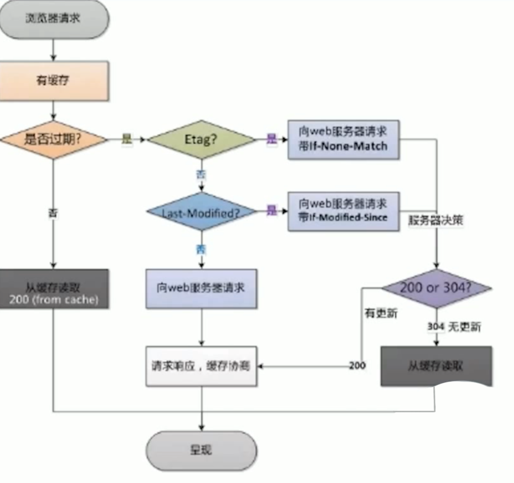

# DNS

DNS：域名 -> IP address

UDP 的公共 DNS 服務極易發生 DNS 劫持，從而造成安全問題

## DNS 問題

突然某個業務有問題，可能考慮是不是DNS的問題，然後再看主幹網，支幹網的問題

- Local DNS 劫持
  - 給個錯的IP地址，以此實現不可告人的秘密
- 域名緩存
  - 通常是運營商為了減少跨網的請求，所以用緩存實現了本網的流量。
- 解析轉發
  - 把 DNS 的解析請求給到別人，導致用戶訪問變慢

TODO: 了解 DNS的 老化、污染、劫持、緩存

## 高可用 DNS 設計

實施監控 + 商務推動：慢，而且不自動化

HTTPDNS： 利用 HTTP 協議與 DNS 服務器交互，繞開運營商的LocalDNS，有效防止域名劫持，提高域名解析度。而且 DNS 服務器端獲取的是`真實客戶端IP`，而非LocalDNS的解析IP，那我們就可以精確定位客戶端地理位置、運營商信息，從而有效改進調度精確性。

- 還有的好處：
  - 平均訪問延遲下降：因為是IP直連
- 用戶連接失敗率下降：
  - 通過算法，對以往失敗率過高的服務器進行排序
  - 通過時間，對近期訪問過的服務器進行排序
  - 通過歷史訪問成功記錄，對服務器進行排序

## CDN 系統架構

CDN流程圖：

- CDN功能
  - 緩存代理：縮短用戶信息的傳輸距離
  - 路由加速：利用接入節點和中繼節點
  - 安全保護：攻擊流量大都指向 CDN，進而保護了用戶源站
  - 節省成本：單線機房，節省成本。通過 CDN 解決互聯互通。
- CND架構
  - 內容路由：DNS系統、應用層重定向，傳輸層重定向。
  - 內容分發：
    - Push：主動分發，把熱點資源分發到外面的節點。
    - Pull：被動分發技術，用戶從邊緣節點獲取miss，就會訪問二級節點，最後返回源站。(收斂比問題)

## CDN 數據一致性

- PUSH：不存在數據一致性問題
- PULL：如果資源名字的一致，且緩存更新不及時，會有數據一致性問題。
  - 設置緩存的失效時間
  - 增量發布： 給文件帶信息（如文件代MD5信息），文件名完全不衝突
  
TODO: 深入了解 HTTP header: Expire, cache control, Last-Modified/If-Modified-Since, Etag

- Expire: HTTP Header 中指明具體失效的時間（HTTP/1.0）
- Cache-Control: Max-age 在 HTTP Header 中按秒指定失效的時間，優先級高於 Expires（HTTP/1.1）
- Last-Modified/ If-Modified-Since: 文件最後一次的修改時間（精度是秒， HTTP/1.0），需要 Cache-Control 過期。
- Etag: 當前資源在服務器的唯一標示（生成規則由服務器決定），優先級高於 Last-Modified

HTTP-Header屬性流程圖

## 靜態 CDN 加速

最小化接受靜態內容所需的跳數，直接從附近邊緣的緩存中獲取內容。結果是顯著降低了延遲和數據包丟失，加快了頁面家在速度，並大大降低了原屬基礎架構的負載。

- 靜態域名非主域名，多個域名可以支持http1的多連結
- 靜態多域名和收斂

## 動態 CDN 加速

加速 API 的動態數據訪問

- TCP 優化：可以設計更激進的滑動窗口算法來處理網絡擁堵和包丟失，加快這些情況下的數據從 CDN 的恢復以及一些常見的 TCP 瓶頸。
- Router optimization：優化路由，返回更快更可靠的路線
- Connection management：很多用戶接到 CDN，但回源只用O(1)個長連接接到 CDN 節點。
  - Conn (n*<->) CDN (1*<->) Source
- On-the-fly compression：壓縮數據然後傳輸
- SSL offload：加速或減少一些安全監測。
