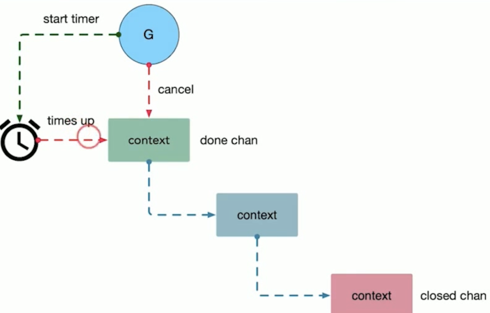

# Context 用好， 服務就無敵了

# Channels

channel & buffer channel

內存的空間換時間到一定程度就不會有變化了，但是適度增大會極大的影響性能（減少喚醒）

同步通訊：unbuffered
異步通訊：buffered

## Patterns
- Timing out
- Moving on
- Pipeline
- Fan-out, Fan-in
- Cancellation
    - Close 先於 Receive 發聲
    - 不需要傳送數據，或者nil
    - 非常適合取消和超時控制
- Contex

# Request-scoped context

當一個請求被取消或者超時時，context 可以快速退出。

Fail fast -> Timing out

*Figure. A request*

## context.WithValue

不斷的 Recursion 獲得 context 直到得到了信息。

context 僅僅是用來掛載信息，不是控制流。 不應該作為函數的可選參數來使用（比如 context 裡面掛了一個 sql.Tx 對象， 傳遞到 data 層使用）

如果需要修改 context 內容，最好的方法是，deep copy 一份，然後改內容，再重新掛載。（生成了一個新的context 再往下游傳遞）

`Replace a Context using WIthCancel, WithDeadline, WithTimeout, or WithValue.`

copy-on-write

## When a Context is canceled, all Contexts derived from it are also canceled.

cancel

## All blocking/long operations should be cancelable

timeout

設置一個定時器，超時了就直接 cancel 掉就好了。
